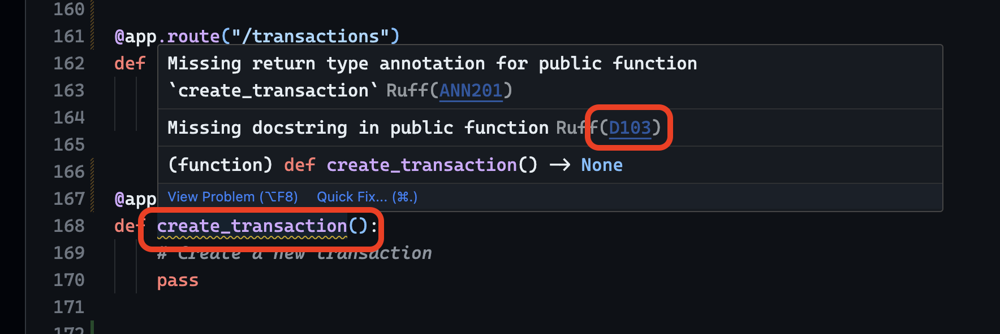

# mthree_bank_project

A project integrating a front end UI with a Python/MySQL based back end through a Flask based web api. Functionality is based on that found in a typical banking app.

## Running Locally

First, install the required dependencies with `pip`:

```sh
# Create a virtual environment, if you haven't already
python3 -m venv .venv
source .venv/bin/activate

# Install the dependencies
pip install .
```

Then, run the Flask server in development mode. This will automatically reload the server when you make changes to the code:

```sh
flask --app src/app run
```

Open [localhost:5000/apidocs](http://localhost:5000/apidocs/) in your browser to view the Swagger UI.

### Running MySQL

To run the MySQL database, use [Docker](https://www.docker.com) with the following command:

```sh
docker run --name mysql -d --restart unless-stopped -p 3306:3306 -e MYSQL_ALLOW_EMPTY_PASSWORD=true mysql:8
```

This will start a MySQL server, available on `localhost:3306` with an empty password. It will run in the background, until you stop it with `docker stop mysql`.

## Linting & formatting

This repository uses [ruff](https://github.com/astral-sh/ruff) for formatting and linting. To run the checks, use the following commands:

```sh
ruff check
```

### Understanding linting errors

If you're unsure about what a linting error means, you can look it up via the warning code. In VSCode, you can also hover over the error to see a description - and click through to the relevant part of the documentation.


